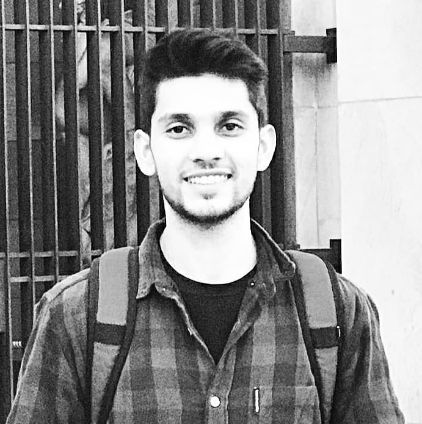

<link rel="stylesheet" href="https://cdnjs.cloudflare.com/ajax/libs/font-awesome/4.7.0/css/font-awesome.min.css">

<table>
<tr>
<th></th>
<th></th>
</tr>

<tr>
<td>
</td>
<td>

Lead Infrastructure Engineer <a href='https://www.and.digital/'>AND Digital</a>, Ex Snr Site Reliability Engineer <a href='https://www.noon.com/uae-en/'>Noon e-commerce</a> Dubai, Ex Site Reliability Engineer <a href='https://www.olxgroup.com/'>OLX Group</a>, Ex DevOps Engineer <a href='https://www.edx.org/'>edX</a>, Ex Software Developer  <a href='https://www.crunchbase.com/organization/plumgrid'>Plumgrid</a>. 
 
 

I love solving problems like every engineer does. I started off my career as a software developer and then transitioned into platform/infrastructure engineering with focus on Site Reliability over the past few years.

Originally from Pakistan, I feel lucky to have worked with some really cool people in some really cool places like Berlin, San Jose, Dubai, Islamabad and London. My experiences in tech industry have made me a better person.

 
 
I can be reached on: 

 

</td>
</tr>
</table>
