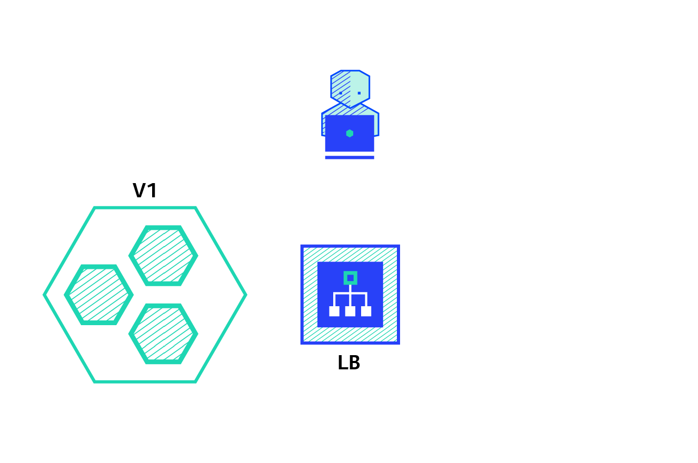

## 6 Most Common Deployment Strategies

### Software Deployment

Software deployment is a combination of all the steps, processes, and activities that are required to make a software system or update available to its intended users.

e.g.
* Installation of software in a physical machine in a data center.

* Upgrading the web application that is accessible on internet on a website.

* Releasing new version of IOS app on app store.

### Best Practices to consider while designing the deployment process

##### Use continuous integration (CI):
Pull code, Build it and test it—continuously. This helps ensure apps will work in your environment, not just in the dev’s personal machine.

##### Adopt continuous delivery (CD):
Continuous delivery helps ensure your code changes are ready for primetime by automatically preparing them to move from deployment to production through rigorous testing. 

##### Rollback plan:
What will you do if things go wrong? Proactively plan ahead for contingencies with a good rollback strategy in place.

##### Zero Downtime:

While deploying there should not be any downtime in the availability of the software.

### Some Widely used Deployment Strategies and their pros and cons

#### 1 - Recreate Deployment

##### V1 is terminated then V2 is rolled out
###### Pros:

* Easy to setup

* Application state entirely renewed

###### Cons:

* Expect downtime that depends on shutdown and boot duration of application.

#### 2 - Rolling Deployment

##### V2 is slowly rolled out, replacing V1

###### Pros:

* Easy to setup

* No downtime required as version is slowly released across instances

###### Cons:

* Rollout/Rollback can be slow

* Control over traffic is limited

#### 3 - Blue/Green Deployment

##### V2 is released alongside V1, then traffic is switched to V2 after testing new version meets all requirements.

###### Pros:

* Instant Rollout/Rollback

* Avoid versioning confusion, the entire application state is changed in one go.

###### Cons:

* Expensive as it requires double resources.

* Extra effort of proper testing is required before releasing V2

#### 4 - Canary Deployment

##### V2 is released to a subset of users, then proceed to a full rollout.

###### Pros:

* Convenient for error rate and performance monitoring

* Fast rollback with low impact

###### Cons:

* Full rollout is slow and gradual

#### 5 - A/B testing

##### V2 is released to a subset of users under specific condition.

###### Pros:

* Several versions live in parallel

* Full control over traffic.

* Good for analysis of end user impact.

###### Cons:

* Requires sophisticated load balancer

* Hard to troubleshoot errors, distributed tracing becomes mandatory

#### 6 - Shadow Deployment

##### V2 is receives real-world traffic in parallel to V1 and doesn’t impact the response.

###### Pros:

* Useful for Performance testing with production traffic

* No rollout until stability and performance of application meet the requirements

###### Cons:

* Expensive as it requires double resources

* Complex to setup

* Requires mocking service for certain cases

* Not a true user test and can be misleading

### Conclusion

One strategy does not fit all requirements. Most of the times companies rely on multiple strategies depending on the use case.

Some factors to consider when choosing strategy:
* Environment
* Budget
* Confidence level in software reliability.
* Amount of tests it goes through before deployment etc

[back](../)
