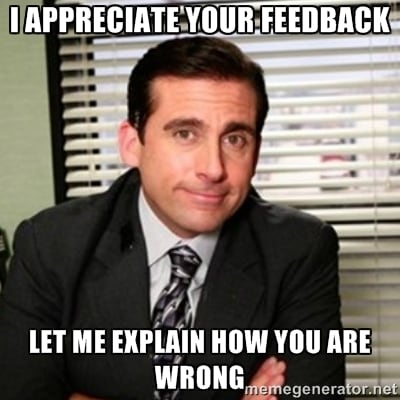

## Everyone will tell you how to give feedback, nobody tells you how to receive it

The concept of 1:1 meetings are very common in tech organizations. As we grow in our career it gets increasingly common to give and receive feedback in professional environment to colleagues.

You will see quite a few articles and guidelines around for managers for how to effectively give feedback to your sub-ordinates so that it has a greater impact. Organizations sometimes even train the managers around this area to improve giving feedback to the team members they are managing. However nobody tells you how to receive the feedback.

For me (and i guess most of us) job was the first sort of moment where I received a developmental feedback from people other than my parents or teachers. After a certain age even parents and teachers stop giving you feedback or you stop listening to it.

When i remember my first feedback from manager in my professional life, here is what comes to my mind:
It was intense, I still remember almost every word of it and how awkward the whole experience was. It was about a project that I worked on with a lot of effort and still fell short of the expectations of my manager and I got defensive and felt like I was being criticized and unappreciated.

Over the period of time in my career, I have learned how to receive feedbacks now. And if you are in the same boat as me you can learn from me here.
I have started doing the following things which has helped and made me feel comfortable sitting in the 1:1s where you get judged every time by your manager:

#### I stopped taking it personally.

When someone says the piece of code you have written had a lot of bugs or needs to be revamped, don't think of it as You are a bad programmer and not good at your job. There can be times when the rock-star programmers (every company has them) in your company will write the buggy code, so its not about you, It is about the mistake you did, which can be done by anyone.

#### Stop giving defensive arguments in feedback

There will be times when you will feel the manager has been a little harsh on you. There is no benefit in convincing them that they are wrong. What happens when you try to give arguments in response to the feedback, some people stop giving you feedback altogether. Most of the humans avoid having difficult conversation, as much of difficult is to receive negative feedback it is same with giving feedback as well. You will get to know once you are at the other side of the table.
So try to listen to the feedback even if its harsh and take it without being defensive about it, this is good in a long run.

#### Be grateful to the feedback provider

As I said earlier it is not easy to give negative feedback also, so If someone is putting energy and time in telling you a few thing that you are falling short in, try to be thankful to them. This way they will be encouraged again to give the feedback even positive in the future also.

#### Follow up on the feedback

Write them down somewhere and try to resolve them and notice if there is any change or betterment over the period of time. If your manager is same over the course of time, sit with him and have a follow up on the feedbacks.

Overall its just a change in perspective which can be highly productive for you moving forward in your career.

Good Luck! &#127866;

[back](../)