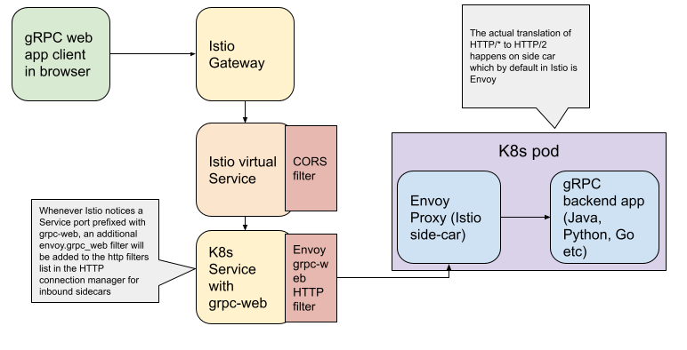

## Running gRPC-web on Istio

#### Intro

gRPC web is the JavaScript implementation of [gRPC][] for browser clients.

There is no current browser that supports HTTP/2 gRPC spec currently. The reason essentially is because raw HTTP/2 frames are inaccessible in browsers. You can read further on this [here](https://grpc.io/blog/state-of-grpc-web/#the-grpc-web-spec). Hence, gRPC-web clients connect to gRPC services via a special proxy; by default, gRPC-web uses [Envoy][]. The purpose of Envoy is to translates the HTTP/1.1 calls produced by the client into HTTP/2 calls that can be handled by those services.


#### Demo

In this post, We will try to see what needs to be done on Istio, Kubernetes and Envoy side to have a gRPC-web client talk (through browser) to gRPC based services deployed in k8s cluster over a service-mesh (Istio). 
The GA release of gRPC-web was announced in October 2018 and since then there is very little documentation on this. The most help I got was from this [article](https://venilnoronha.io/seamless-cloud-native-apps-with-grpc-web-and-istio) by *Venil Noronha*. But this was also written approximately 3 years ago so here is my take with latest versions.

#### Architecture

#### Extra requirements

Considering you have a backend app ready locally, you can test it tools like [grpcurl](https://github.com/fullstorydev/grpcurl), [grpcui](https://github.com/fullstorydev/grpcui) or [evans cli](https://github.com/ktr0731/evans) which you are comfortable with. When deploying to the Kubernetes cluster, you need to make sure the following things:

##### Istio Gateway
On the gateway side you need to allow specific ports for http and https traffic. You can also allow a specific port for gRPC traffic in case you want to call backend from another gRPC service through gateway but it's not a requirement in our case with grpc-web.

```yaml
apiVersion: networking.istio.io/v1alpha3
kind: Gateway
metadata:
  name: gateway
spec:
  selector:
    istio: ingressgateway
  servers:
    - hosts:
        - '*'
      port:
        name: http
        number: 8080
        protocol: HTTP
      tls:
        httpsRedirect: true
    - hosts:
        - '*'
      port:
        name: https
        number: 8443
        protocol: HTTPS
      tls:
        mode: SIMPLE
    - hosts:
        - '*'
      port:
        name: grpc
        number: 50051
        protocol: GRPC
```


##### Backend Kubernetes Service
You have to add the port name with prefix `grpc-web` so that Kubernetes recognizes it as gRPC based service and Istio automatically adds the http listeners required on envoy side for grpc-web. Further read on this [here](https://github.com/istio/istio/pull/10064)

```yaml
apiVersion: v1
kind: Service
metadata:
  name: backend
spec:
  ports:
    - name: grpc-web
      port: 50051
      protocol: TCP
      targetPort: 50051
  selector:
    name: backend
  type: ClusterIP
```
##### Backend Istio Virtual Service
grpc-web do require a complex CORS policy to work properly and the port should match the one you have given in gateway for that specific traffic e.g. in our case https

```yaml
apiVersion: networking.istio.io/v1alpha3
kind: VirtualService
metadata:
  name: backend-vs
spec:
  gateways:
    - gateway
  hosts:
    - "*"
    - corsPolicy:
        allowCredentials: true
        allowHeaders:
          - grpc-timeout
          - content-type
          - keep-alive
          - user-agent
          - cache-control
          - content-type
          - content-transfer-encoding
          - custom-header-1
          - x-accept-content-transfer-encoding
          - x-accept-response-streaming
          - x-user-agent
          - x-grpc-web
        allowMethods:
          - POST
          - GET
          - OPTIONS
          - PUT
          - DELETE
        allowOrigins:
          - regex: "*"
        exposeHeaders:
          - content-type
          - grpc-status
          - grpc-message
        maxAge: 1728s
      match:
        - port: 8443
      route:
        - destination:
            host: backend
            port:
              number: 50051
```

##### Frontend code
The URL to call from the frontend code is https based where host url is the one in virtual service but you can also do http and change the matching port config in virtual service.

```javascript
var echoService = new proto.mypackage.EchoServiceClient('https://backend-host-url-in-vritualservice');
```
##### Deploying Frontend
For the rest of the things and deploying frontend etc you dont really need any extra configuration.

#### Conclusion
Deploying grpc-web on k8s + Istio does require a few extra configurations but all of them are quite reasonable and not as painful as I thought. Good Luck!

[Envoy]: https://www.envoyproxy.io
[gRPC]: https://grpc.io

[back](../)